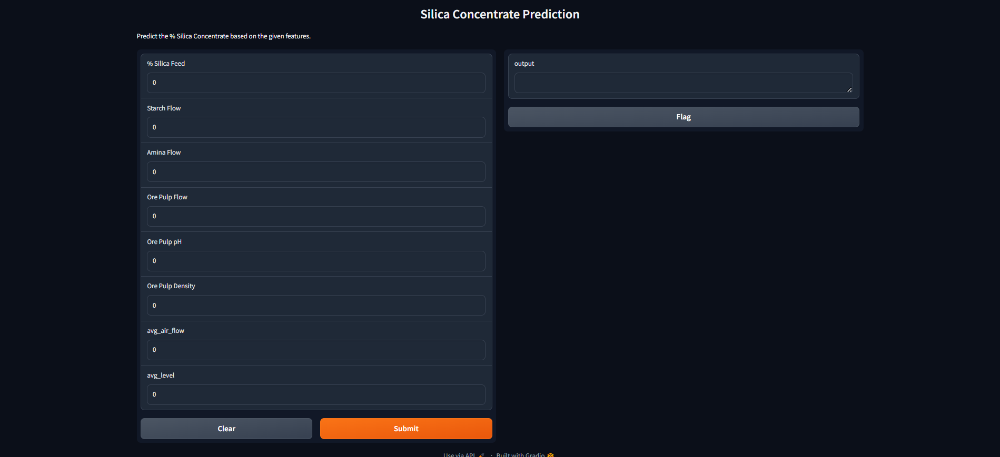
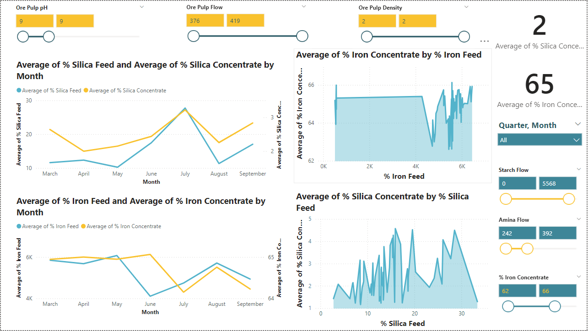

# Mining Process Flotation Plant Analysis and Model Deployment

## Project Overview

This repository contains a comprehensive analysis of a Mining Process Flotation Plant dataset, including Exploratory Data Analysis (EDA), model training using Random Forest, and deployment using Gradio. Additionally, it features Power BI visualizations to provide insightful dashboards for the dataset.

## Project Components

1. **Exploratory Data Analysis (EDA)**
   - Performed initial analysis to understand the dataset and its features.
   - Conducted statistical summaries and visualizations to explore data patterns and relationships.

2. **Model Training**
   - **Algorithm**: Random Forest
   - **Performance Metrics**:
     - Mean Squared Error (MSE): 0.0618
     - R-squared (R²): 0.9509
   - Model trained to predict key metrics based on input features.

3. **Model Deployment**
   - **Framework**: Gradio
   - Deployed the trained model as a web application to allow interactive predictions and model evaluation.

   
   *Screenshot of the Gradio interface*

4. **Power BI Visualizations**
   - Created interactive dashboards to visualize the mining process data.
   - Included various visualizations such as scatter plots, line charts, and slicers for dynamic data exploration.

   
   *Screenshot of the Power BI dashboard*

## Getting Started

### Prerequisites

- Python 3.7+
- Power BI Desktop
- Gradio
- Required Python libraries:
  - pandas
  - numpy
  - scikit-learn
  - matplotlib
  - seaborn
  - gradio

### Installation

1. **Clone the Repository**
   ```bash
   git clone https://github.com/Abuhamida/Quality-Prediction-in-a-Mining-Process.git
   cd Quality-Prediction-in-a-Mining-Process
